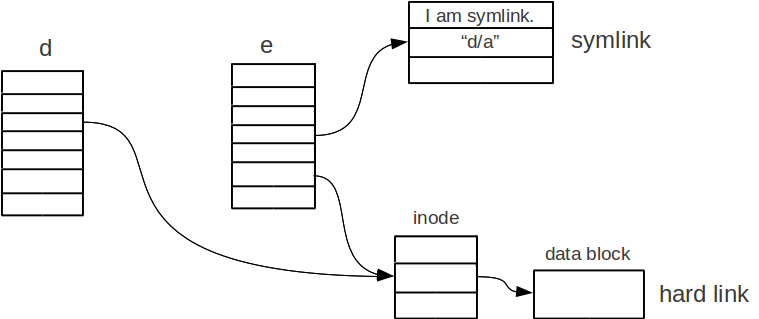
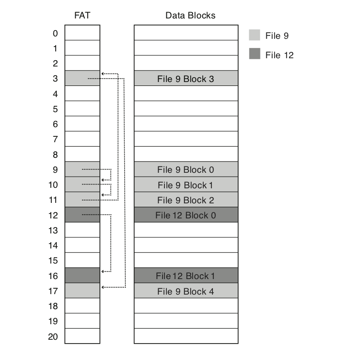
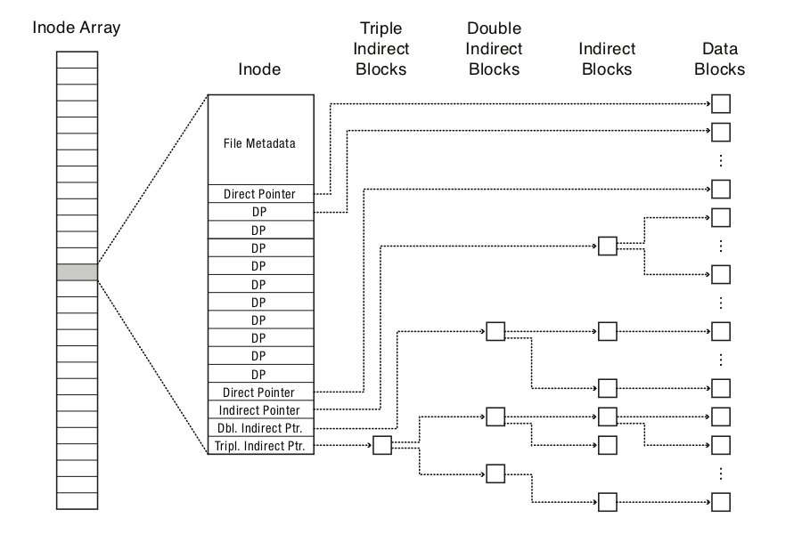
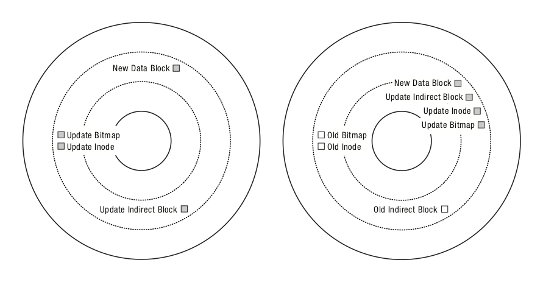

# Week 9: Local File System Internals

## VFS, Page Cache, and Durability

> "Everything is a file — but what *is* a file?"

---

# The Big Question

**You call `write(fd, buf, 4096)`. What actually happens?**

By the end of today you should be able to trace the path from the syscall through:

1. **VFS** — the indirection layer
2. **Page cache** — the kernel's hidden buffer
3. **Filesystem** — layout, journaling, allocation
4. **Block layer** — I/O scheduler, device driver
5. **Disk** — where bits finally rest

---

# Part I: The Virtual Filesystem (VFS)

---

# Why VFS?

Linux supports dozens of filesystems: ext4, xfs, btrfs, tmpfs, overlayfs, NFS, FUSE...

Yet every user program uses the same syscalls:
```c
open(), read(), write(), close(), stat(), mkdir() ...
```

**VFS is the abstraction layer that makes this possible.**

Same idea as the scheduler: one interface, many policies.

---

# VFS: Four Core Objects

```
┌──────────────────────────────────────────────────────────┐
│                    VFS Layer                             │
│                                                          │
│  superblock ──── inode ──── dentry ──── file             │
│  (filesystem)    (on-disk   (directory   (open file      │
│                   object)    entry)       handle)        │
└──────────────────────────────────────────────────────────┘
```

| Object | Represents | Lifetime |
|--------|-----------|----------|
| `superblock` | A mounted filesystem | Mount to unmount |
| `inode` | A file/directory (metadata + data pointers) | As long as referenced |
| `dentry` | A path component (`/home/user/foo.txt` → 3 dentries) | Cached, can be evicted |
| `file` | An open file descriptor | `open()` to `close()` |

---

# VFS: The Indirection

Each filesystem registers a `struct` of function pointers:

```c
// Simplified — the real structs have ~30 methods each
struct inode_operations {
    int (*create)(struct inode *, struct dentry *, ...);
    struct dentry *(*lookup)(struct inode *, struct dentry *, ...);
    int (*mkdir)(struct inode *, struct dentry *, ...);
    int (*unlink)(struct inode *, struct dentry *);
};

struct file_operations {
    ssize_t (*read)(struct file *, char __user *, size_t, loff_t *);
    ssize_t (*write)(struct file *, const char __user *, size_t, loff_t *);
    int (*fsync)(struct file *, loff_t, loff_t, int);
};
```

**VFS dispatches your syscall to the right filesystem's implementation.**

---

# VFS in Action: `open("/home/user/notes.txt", O_RDWR)`

```
1. Parse path: "/" → "home" → "user" → "notes.txt"

2. For each component, look up dentry cache:
   dentry "/" → inode of root → lookup "home"
   dentry "home" → inode of /home → lookup "user"
   ...

3. On final component:
   - Found inode for notes.txt
   - Allocate struct file
   - Set f_op = inode's file_operations (ext4_file_operations)
   - Return fd to userspace
```

After this, `read(fd, ...)` calls `ext4_file_operations.read()`.

---

# Connection: Overlay FS

Remember that container images use **overlayfs**?

```
Upper (writable)    ← container writes go here
Lower (read-only)   ← base image
Merged view         ← what the process sees
```

Overlayfs is *just another VFS implementation*:
- It registers its own `inode_operations` and `file_operations`
- On read: check upper, fall through to lower
- On write: copy-up from lower to upper, then modify

**VFS made this composability possible.**

---

# The Inode: What's on Disk

```
struct ext4_inode (simplified):
┌────────────────────────────────┐
│ mode (permissions, type)       │
│ uid, gid                       │
│ size                           │
│ timestamps (atime/mtime/ctime) │
│ link count                     │
│ block count                    │
│ extent tree root               │  ← points to data blocks
└────────────────────────────────┘
```

Key insight: **filename is NOT in the inode**. It lives in the directory entry.

Multiple filenames can point to the same inode → **hard links**.

---

# Hard Links vs Soft Links



**Hard link** — directory entry pointing directly to an inode. `ln` / `link()`
- Multiple names, same inode, same data blocks
- Deleting one name decrements link count; data persists until count = 0
- Cannot cross filesystem boundaries; cannot link to directories

**Soft (symbolic) link** — a tiny file whose content is a *pathname string*. `ln -s`
- Kernel follows the stored path at access time
- Can cross filesystems, can point to directories
- Target deleted → symlink becomes a **dangling reference**

---

# Directories: How Name → Inode Works

A directory is just a file. Its data is a table of `(name, inode#)` pairs:

```
Directory data for /home/user/:
┌──────────┬─────────┐
│  Name    │ Inode#  │
├──────────┼─────────┤
│  .       │  42     │
│  ..      │   2     │
│  foo.txt │ 231     │
│  bar/    │ 731     │
└──────────┴─────────┘
```

**Early design (ext2):** linked list of variable-length entries — O(n) lookup.

**Modern design:** hash-indexed tree (ext3+ HTree, XFS B+tree)
- O(1) or O(log n) lookup
- `ls` in a directory with 100k files: fast on ext4, painfully slow on FAT

This is why VFS's **dentry cache** matters — it avoids hitting these on-disk structures on every path lookup.

---

# Part II: Page Cache

---

# The Page Cache: Why It Exists

Reading from disk: ~100 μs (SSD) to ~10 ms (HDD)
Reading from memory: ~100 ns

**The kernel keeps recently-accessed file data in memory.**

```
┌─────────────────────────────────────────────────────────────┐
│                    Page Cache                               │
│                                                             │
│  File A, page 0   File A, page 1   File B, page 0 ...       │
│  [  Clean  ]      [  Dirty  ]      [  Clean  ]              │
│                                                             │
│  Clean = matches disk     Dirty = modified, not yet flushed │
└─────────────────────────────────────────────────────────────┘
```

---

# Read Path Through Page Cache

```c
ssize_t bytes = read(fd, buf, 4096);
```

```
1. VFS → ext4_file_read_iter()
2. Check page cache for the page
   ├─ HIT:  memcpy to user buffer → return (fast path, ~μs)
   └─ MISS: allocate page → submit block I/O → wait
            → copy to user buffer → return (slow path, ~ms)
3. Readahead: kernel pre-fetches next pages if sequential
```

---

# Write Path Through Page Cache

```c
ssize_t bytes = write(fd, buf, 4096);
```

```
1. VFS → ext4_file_write_iter()
2. Find (or allocate) the page in page cache
3. memcpy user data into page → mark page DIRTY
4. Return to userspace ← write() returns here!
   
   ... sometime later ...

5. Writeback thread (kworker/flush) picks up dirty pages
6. Submit block I/O to device
7. On completion: mark page CLEAN
```

**`write()` does NOT wait for disk.** It's just a `memcpy` into kernel memory.

---

# The Dirty Page Lifecycle

```
                write()
                  │
                  ▼
    ┌─────────────────────────┐
    │   Page marked DIRTY     │
    └─────────┬───────────────┘
              │
     ┌────────┴────────────────────────┐
     │  Triggers for writeback:        │
     │  1. dirty_ratio exceeded        │
     │  2. dirty_expire_centisecs      │
     │  3. Explicit fsync()            │
     │  4. Memory pressure (reclaim)   │
     └────────┬────────────────────────┘
              │
              ▼
    ┌─────────────────────────┐
    │  Block I/O submitted    │
    └─────────┬───────────────┘
              │
              ▼
    ┌─────────────────────────┐
    │  Page marked CLEAN      │
    └─────────────────────────┘
```

---

# Writeback Tunables

```bash
# Maximum % of total memory that can be dirty before writer BLOCKS
$ cat /proc/sys/vm/dirty_ratio
20

# % of total memory before background writeback STARTS
$ cat /proc/sys/vm/dirty_background_ratio
10

# How often writeback thread wakes up (centiseconds)
$ cat /proc/sys/vm/dirty_writeback_centisecs
500

# How old a dirty page must be before writeback (centiseconds)
$ cat /proc/sys/vm/dirty_expire_centisecs
3000
```

**Tuning these = tradeoff between write throughput and data-at-risk window.**

---

# Observing the Page Cache

```bash
# How much memory is used for page cache?
$ free -h
              total    used    free   shared  buff/cache   available
Mem:          7.7Gi   1.2Gi   4.1Gi   200Mi     2.4Gi       6.0Gi
                                                 ^^^^^ this includes page cache

# How many dirty pages right now?
$ cat /proc/meminfo | grep -i dirty
Dirty:              1284 kB

# Per-file cache status (requires vmtouch or fincore)
$ vmtouch myfile.dat
           Files: 1
     Directories: 0
  Resident Pages: 256/256  1M/1M  100%
```

---

# Working-set and page faults

When RAM is full, the kernel must **evict** page cache pages to make room:
- Clean pages → just drop them (free, can re-read from disk)
- Dirty pages → must write back first, *then* drop

This is why **memory pressure causes I/O storms** — the kernel is flushing dirty pages under time pressure, competing with your application's reads/writes.

---

# Below the Page Cache: Block I/O

Once the kernel flushes a dirty page, what happens next?

```
Dirty page
    │
    ▼
struct bio ──── "write these bytes to device X, sector Y"
    │
    ▼
I/O Scheduler ── merges adjacent requests, reorders for efficiency
    │              (mq-deadline / bfq / none)
    ▼
Device Driver ── sets up DMA transfer
    │              CPU is free during the actual data movement
    ▼
Device ── SSD controller firmware / disk platter mechanics
    │
    ▼
Completion interrupt → page marked clean
```

**DMA (Direct Memory Access):** the device copies data to/from RAM directly — the CPU doesn't touch each byte. When the transfer finishes, the device fires an interrupt.

---

# Part III: Filesystem Internals

---

# Every Filesystem Answers Three Questions

| Decision | Question | Examples |
|----------|----------|---------|
| **Index structure** | File + offset → which disk block? | Linked list, tree, extent map |
| **Free space tracking** | Which blocks are available? | FAT array, bitmap, extent tree |
| **Locality heuristics** | Where should new blocks go? | Next-fit, block groups, best-fit |

These choices shape the entire performance profile: sequential throughput, random I/O latency, metadata overhead, fragmentation behavior.

Every filesystem design is a tradeoff among these three. Let's see how the designs evolved.

---

# FAT: The Simplest Possible Design (1977)



Index = a single **File Allocation Table** — essentially a linked list of block entries.

File #9 starts at FAT[9], next block is FAT[9]'s value, and so on until EOF.

---

# FAT: The Simplest Possible Design

**Why it breaks down:**
- Read block N of a file → chase N pointers. O(n) random access.
- One table for the whole volume — corrupt it, lose everything.
- Next-fit allocation → fragmentation → the classic Windows "defrag" ritual.
- 4 GB max file size (FAT-32).

Still lives on USB sticks and SD cards — simplicity wins for removable media.

---

# FFS: The Multilevel Index (1984)

FFS replaced the linked list with a **tree rooted in the inode**:



--- 

# FFS: The Multilevel Index (1984)

- 12 **direct** pointers → first 48 KB with no indirection
- 1 **indirect** → 1024 more pointers → ~4 MB
- 1 **double indirect** → 1024² → ~4 GB
- 1 **triple indirect** → 1024³ → ~4 TB

Random access to any block: walk down the right branch. O(1) — huge improvement.

---

# ext4: The Default Linux Filesystem

Direct descendant: FFS → ext2 → ext3 → **ext4** (2008).

What changed from FFS/ext2?
- **Extents** replace per-block pointers — one entry covers a contiguous run
- **Journaling** (from ext3) — crash consistency without full `fsck`
- 48-bit block addresses → volumes up to 1 EB
- **Delayed allocation** — assign physical blocks at writeback time, not at `write()`, so the allocator sees the full picture and can make better locality decisions

Default on Ubuntu, Debian, RHEL. Mature, battle-tested, excellent tooling.

---

# ext4 Disk Layout

```
┌────────┬──────────────┬──────────────┬──────────────┬─────────┐
│ Boot   │ Block Group 0│ Block Group 1│ Block Group 2│  ...    │
│ Sector │              │              │              │         │
└────────┴──────────────┴──────────────┴──────────────┴─────────┘

Each Block Group:
┌──────┬────────┬──────────┬───────────┬──────────┬────────────┐
│Super │ Group  │ Block    │ Inode     │ Inode    │ Data       │
│block │ Desc.  │ Bitmap   │ Bitmap    │ Table    │ Blocks     │
│(copy)│        │          │           │          │            │
└──────┴────────┴──────────┴───────────┴──────────┴────────────┘
```

**Block group** = locality unit. Files are allocated close to their directory's block group → reduces seek time.

---

# Extents vs Block Pointers

**Old (ext2/3):** indirect block pointers
```
inode → [blk0, blk1, ..., blk11, indirect, double-ind, triple-ind]
```
Lots of metadata for large files.

**ext4:** extents
```
Extent: (logical_block=0, physical_block=1000, length=500)
```
One extent = one contiguous run of blocks.

A 1 GB sequential file might need just 1–2 extents vs thousands of block pointers.

**`filefrag` shows you a file's extent layout:**
```bash
$ filefrag -v myfile
Filesystem type: ext4
ext:  logical_offset: physical_offset: length:  expected: flags:
  0:        0..   255:   2048..  2303:    256:             last,eof
```

---

# Journaling: Crash Consistency

**The problem:** Updating a file may require multiple disk writes (data block, inode, bitmap). A crash mid-update leaves the filesystem inconsistent.

**The solution:** Write-ahead log (journal).

```
Step 1: Write planned changes to journal
Step 2: Write actual data + metadata
Step 3: Mark journal entry complete

Crash during step 2? → Replay journal on mount
```

---

# ext4 Journaling Modes

| Mode | What's Journaled | Safety | Performance |
|------|------------------|--------|-------------|
| `journal` | Data + metadata | Highest | Slowest |
| `ordered` (default) | Metadata only; data written before metadata | Good | Good |
| `writeback` | Metadata only; no ordering | Lowest | Fastest |

```bash
# Check current mode
$ cat /proc/mounts | grep " / "
/dev/sda1 / ext4 rw,relatime,errors=remount-ro,data=ordered 0 0
                                                 ^^^^^^^^^^^^
```

**`data=ordered`** is why `write()` + `fsync()` is safe: ext4 guarantees data hits disk before metadata is committed.

---

<!-- _class: small-table -->

# Filesystem Design Comparison

| | **FAT** | **FFS/ext2** | **ext4** | **btrfs/ZFS** |
|---|---|---|---|---|
| Index | Linked list | Multilevel tree | Extent tree | COW tree |
| Granularity | Block | Block | Extent | Block/extent |
| Free space | FAT array | Bitmap | Bitmap | Space map / extent tree |
| Locality | Next-fit + defrag | Block groups | Block groups + delayed alloc | Write-anywhere + batching |
| Journaling | ✗ | ✗ (ext3+: ✓) | ✓ | Not needed (COW) |
| Crash recovery | fsck (slow) | fsck (slow) | Journal replay (fast) | Txn group replay |

**Every row is a design tradeoff.** No filesystem wins on every dimension.

---

# Copy-on-Write: A Different Philosophy

**Traditional (ext4):** update data in place, use a journal for crash consistency.

**COW (btrfs, ZFS):** never overwrite — write new versions to new locations.



---

# Copy-on-Write: A Different Philosophy

**Advantages:** free snapshots and versioning, no separate journal needed, atomic updates by pointer swing. Natural fit for SSDs (flash is internally COW anyway).

**Trade-offs:** fragmentation over time (scattered blocks), more metadata writes per update (must rewrite path from changed block up to the root).

---

# Putting It Together: Reading `/foo/bar/baz`

```
Step 1:  inode 2 (root, hardcoded)    → read dir data block
Step 2:  scan root dir                → "foo" = inode 231
Step 3:  read inode 231 (/foo)        → read dir data block
Step 4:  scan /foo dir                → "bar" = inode 731
Step 5:  read inode 731 (/foo/bar)    → read dir data block
Step 6:  scan /foo/bar dir            → "baz" = inode 402
Step 7:  read inode 402               → get data block pointers
Step 8:  read data blocks             → return file content
```

**8 disk reads** in the worst case. But the **dentry cache** and **page cache** usually eliminate steps 1–6. This is why repeated `open()` calls are fast, and why `echo 3 > /proc/sys/vm/drop_caches` makes everything slow again.

---

# Part IV: Durability — fsync and Its Friends

---

# The Durability Spectrum

| Operation | Guarantee | Latency |
|-----------|-----------|---------|
| `write()` | In page cache (volatile) | ~1 μs |
| `fdatasync(fd)` | Data on stable storage | ~0.5–5 ms |
| `fsync(fd)` | Data + metadata on stable storage | ~0.5–10 ms |
| `O_SYNC` | Every write waits for stable storage | ~0.5–10 ms per write |
| `O_DIRECT` | Bypass page cache (NOT durability!) | ~100 μs–1 ms |

**Common misconception:** `O_DIRECT` does NOT guarantee durability. It bypasses the page cache but the device may still have a write cache. You still need `fsync`.

---

# Why fsync Is Slow

```
fsync(fd)
  │
  ├─ 1. Flush file's dirty pages from page cache
  │     (submit block I/O, wait for completion)
  │
  ├─ 2. Flush filesystem journal (if using journaling)
  │     (may need to wait for OTHER files' journal entries!)
  │
  ├─ 3. Issue storage device cache flush (FUA / FLUSH)
  │     (ensures device's write cache hits persistent media)
  │
  └─ 4. Return to userspace
```

Each step can take milliseconds. Steps 2 and 3 are the surprise — **your fsync pays for other files' metadata updates.**

---

# The Bimodal Latency Problem

```
Latency Distribution of write() + fsync():

│  ████████████████████          (p50: ~0.5 ms)
│          
│                    ██          (p99: ~5 ms)
│                       █        (max: ~50 ms)
└────────────────────────────────►
   0.1ms   1ms    10ms    100ms
```

**What causes the tail?**
1. Background writeback contention
2. Journal commit blocking
3. Device queue saturation
4. SSD garbage collection

---

# Write Amplification

Your app writes 4 KB. How much actually hits the disk?

```
Application data:        4 KB
+ Journal entry:         4 KB  (write-ahead log)
+ Inode update:          ~256 B (metadata)
+ Block bitmap:          ~4 B
+ SSD FTL overhead:      variable
─────────────────────────────
Total device writes:     8–16 KB → Write amplification = 2–4×
```

This matters for:
- **SSD endurance** — SSDs have finite write cycles
- **Throughput** — More writes = less available bandwidth
- **Tail latency** — More I/O = more queuing delay

---

# Part V: Observability

---

# Tool: `filefrag` — File Physical Layout

```bash
$ filefrag -v largefile.dat
Filesystem type is: ef53
File size of largefile.dat is 104857600 (25600 blocks of 4096 bytes)
 ext:   logical: physical:  length:   expected: flags:
   0:     0.. 25599:  34816.. 60415:  25600:             last,eof
```

One extent = perfectly contiguous. Fragmented files show many small extents.

---

# Tool: `debugfs` — Inspect ext4 Internals

```bash
# Read-only inspection of a mounted filesystem
$ sudo debugfs -R "stat /home/user/test.txt" /dev/sda1
Inode: 131073   Type: regular    Mode:  0644   Flags: 0x80000
Size: 4096
Blocks: 8 (4k blocks)
Extents:
  0: (0): 262144

$ sudo debugfs -R "ls -l /home/user/" /dev/sda1
```

You can see inode numbers, extent maps, timestamps — the raw on-disk truth.

---

# Tool: `/proc/meminfo` — Dirty Pages

```bash
# How much data is at risk right now?
$ grep -E "Dirty|Writeback" /proc/meminfo
Dirty:             12840 kB    ← data not yet on disk
Writeback:             0 kB    ← currently being written
```

**Exercise:** Run `dd if=/dev/zero of=bigfile bs=1M count=500` and watch `Dirty` climb, then fall as writeback kicks in.

---

# Tool: `iostat` — Block Device Statistics

```bash
$ iostat -x 1
Device   r/s    w/s   rkB/s   wkB/s   await  %util
sda     10.0  100.0   40.0   400.0    2.50    8.0
```

| Metric | What It Tells You |
|--------|-------------------|
| `w/s` | Write IOPS — how busy the device is |
| `await` | Average I/O wait (ms) — **this is your latency** |
| `%util` | Device utilization — saturation signal |

---

# Tool: eBPF Tracing

```bash
# Block I/O latency histogram
$ sudo biolatency-bpfcc -D

# Trace slow ext4 operations (>1ms)
$ sudo ext4slower-bpfcc 1

# Trace fsync syscalls
$ sudo bpftrace -e '
tracepoint:syscalls:sys_enter_fsync { @start[tid] = nsecs; }
tracepoint:syscalls:sys_exit_fsync /@start[tid]/ {
    @us = hist((nsecs - @start[tid]) / 1000);
    delete(@start[tid]);
}'
```

**In VM:** eBPF may have limited support. `strace -T` and `iostat` always work.

---

# Part VI: Case Studies

---

# Case Study 1: PostgreSQL fsync Bug (2018)

PostgreSQL assumed: if `fsync()` fails, retry later — the dirty page is still in cache.

**Reality on some kernels:** failed `fsync()` marks the page clean and *drops it*.

```c
// PostgreSQL's old (broken) assumption:
if (fsync(fd) == -1) {
    // Page still dirty in cache, retry later...
    // WRONG: page may have been evicted!
}
```

**Lesson:** The contract between application and kernel is subtle. Test your assumptions.

---

# Case Study 2: Container Overlay Write Amplification

Remember overlayfs from Week 5?

```
Write 1 byte to a file in lower layer:
1. Copy ENTIRE file from lower → upper (copy-up)
2. Modify 1 byte in upper copy
3. Page cache + journal + block I/O for full file
```

A 100 MB file → 100 MB of writes for a 1-byte change.

**This is why container startup can be I/O heavy** — lots of copy-ups on first write.

---

# Case Study 3: Redis AOF Persistence

Redis Append-Only File:
```
appendfsync always    # fsync every command  → safe, ~1000 ops/s
appendfsync everysec  # fsync every second   → compromise, ~100k ops/s  
appendfsync no        # OS decides           → fast, up to 30s data loss
```

**Key insight:** The entire performance profile changes based on one `fsync` policy choice.

We'll explore Redis persistence hands-on in Week 10.

---

# Summary

```
  Application
      │
      ▼
    VFS ───── uniform interface (open/read/write/close)
      │
      ▼
  Page Cache ── fast reads, async writes, dirty page tracking
      │
      ▼
  Filesystem ── layout (ext4 extents), journaling, allocation
      │
      ▼
  Block Layer ── I/O scheduling, merging
      │
      ▼
  Storage Device ── where bits persist (eventually)
```

**Key takeaways:**
1. `write()` is a `memcpy` — durability requires `fsync`
2. VFS lets Linux compose filesystems (overlayfs = container magic)
3. Journaling trades write amplification for crash consistency
4. Page cache is shared memory — memory pressure = I/O storms

---

# Lab 9 Preview

**"Anatomy of a File Write"**

You will:
1. Inspect a file's physical layout with `filefrag` / `debugfs`
2. Measure write latency ± fsync — build and run `write_latency.c`
3. Observe dirty page writeback in real time
4. Create interference and measure tail latency

---

# Questions?

---

# Break (5 min)

Then we start Lab 9.
